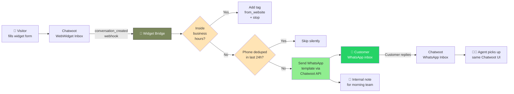

<div align="center">

# 🌉 Chatwoot Widget Bridge

**Recover after-hours website leads automatically via WhatsApp.**

[]()
[](https://www.python.org/)
[](https://fastapi.tiangolo.com/)
[](https://docker.com/)
[](LICENSE)
[]()

</div>

---

## 🎯 The Problem We Solved

> *"عملاء يتواصلون عبر widget الموقع خارج أوقات العمل، يطلب منهم البريد الإلكتروني، يتجاهلونه، نخسرهم — لا طريقة للرجوع لهم."*

A customer fills the website chat form at **2 AM**. The bot asks for an email. They close the browser. **You never hear from them again.** Multiply that by every weekend, every Friday, every late night.

This bridge **closes that loophole** by automatically pivoting outside-of-hours conversations to WhatsApp — using a Meta-approved **UTILITY** template.

## ✨ What It Does

When a customer fills the Chatwoot WebWidget form **outside business hours**:

1. 🔔 Chatwoot fires a `conversation_created` webhook
2. ⚡ The bridge intercepts it (~200ms)
3. 🛡️ Filters: right inbox? valid phone? not already pushed in 24h?
4. 🕐 Checks working hours (Asia/Riyadh, Sat–Thu 9am–midnight, Friday closed)
5. 💬 Sends an approved WhatsApp template to the customer's phone
6. 📝 Drops an internal note in the original conversation for the morning team

The customer's WhatsApp now has a **persistent thread** with your business — they can reply hours, days, or weeks later. **No more lost leads.**

**During business hours?** The bridge does *nothing* (just tags the conversation). Your team replies live in the widget like normal.

## 🏛️ Architecture



## 🧰 Tech Stack

| Layer | Tool |
|---|---|
| **API** | FastAPI 0.115 + Uvicorn (uvloop) |
| **HTTP client** | httpx (async) |
| **Dedup store** | Redis 7 (shared with Chatwoot, isolated DB index) |
| **Config** | Pydantic Settings |
| **Container** | Python 3.12-slim, ~80 MB image |
| **Network** | Internal Docker only — never exposed to internet |
| **Resources** | 256 MB RAM cap, 0.5 CPU cap |

## 🚀 Quick Start

### Prerequisites

- Chatwoot 4.x running on Docker (with `chatwoot_internal` network)
- WhatsApp Cloud API channel already configured in Chatwoot
- An **APPROVED** Meta WhatsApp template (UTILITY recommended)
- A Chatwoot user API token (Profile → Settings → Access Token)

### One-time setup

```bash
# 1. Clone
git clone git@github.com:atmenai/chatwoot-widget-bridge.git
cd chatwoot-widget-bridge

# 2. Configure
cp .env.example .env
nano .env   # fill in real values
chmod 600 .env

# 3. Generate webhook secret
openssl rand -hex 32   # paste into WEBHOOK_SECRET in .env

# 4. Build & launch
docker compose up -d --build

# 5. Verify health
docker run --rm --network chatwoot_internal curlimages/curl:latest \
  -s http://widget-bridge:8000/health | jq
```

### Register the webhook in Chatwoot

```ruby
# Run inside chatwoot_web container:
docker exec chatwoot_web bundle exec rails runner '
url = "http://widget-bridge:8000/webhook/chatwoot/YOUR_WEBHOOK_SECRET"
Webhook.create!(
  account_id: 1,
  url: url,
  subscriptions: ["conversation_created"],
  inbox_id: 3   # your WebWidget inbox ID
)
'
```

That's it. The bridge will start processing webhooks immediately.

## 🛡️ Safety Mechanisms

The bridge ships with **multiple defensive layers** because no automated system should ever spam a customer:

| Layer | Why it matters |
|---|---|
| **DRY_RUN flag** | Default `true`; zero real sends until explicitly flipped |
| **Inbox filter** | Only processes events from `WIDGET_INBOX_ID`; ignores all others |
| **Phone validator** | Normalizes Saudi formats; drops invalid/missing numbers |
| **Redis dedup (24h)** | Same number can't receive two pushes in a day |
| **Business-hours guard** | Hard-coded `return` path before any send call when in-hours |
| **Webhook secret in URL** | 64-byte hex, embedded in path; unguessable |
| **Internal Docker network** | No public exposure — even if secret leaks, can't be called from outside |
| **Resource caps** | 256 MB / 0.5 CPU prevents runaway processes |
| **Healthcheck** | Auto-restart if hung |
| **Fail-open dedup** | If Redis is down, allows send (better risk a duplicate than lose customer) |
| **Fail-closed sends** | If template lookup fails, dedup is released and event marked errored |

## 📡 API

| Endpoint | Method | Auth | Purpose |
|---|---|---|---|
| `/health` | GET | none | Liveness + Redis status + current decision baseline |
| `/stats?limit=50` | GET | none | Last N processed events for debugging |
| `/webhook/chatwoot/{secret}` | POST | secret in path | Chatwoot's webhook target |
| `/webhook/chatwoot` | POST | `X-Webhook-Secret` header | Same logic, alternative auth for manual tests |

### Sample `/health`
```json
{
  "status": "ok",
  "dry_run": false,
  "template": "website_ooh_v1",
  "redis_ok": true,
  "now_local": "2026-05-10T16:54:46.721520+03:00",
  "business_hours": true
}
```

## 🔍 Decision Matrix

| Event | Inbox | Phone | Time | Result |
|---|---|---|---|---|
| `conversation_created` | ≠ widget | — | — | `skip: wrong_inbox` |
| `conversation_created` | widget | missing | — | `skip: no_valid_phone` |
| `conversation_created` | widget | valid | **in-hours** | `in_hours_no_send` + tag |
| `conversation_created` | widget | valid | **OOH**, dedup hit | `skip_dedup` |
| `conversation_created` | widget | valid | **OOH**, fresh | `sent` ✉️ + tag + internal note |
| any other event | — | — | — | `skip: not_conversation_created` |

## 🛠️ Operations

```bash
# Tail logs
docker logs -f widget_bridge

# Recent events
curl -s http://widget-bridge:8000/stats?limit=50 | jq '.events[]'

# Pause sending (without stopping container)
sed -i 's/^DRY_RUN=.*/DRY_RUN=true/' .env
docker compose up -d --force-recreate

# Hot-swap WhatsApp template (after Meta approval)
sed -i 's/^TEMPLATE_NAME=.*/TEMPLATE_NAME=new_template/' .env
docker compose up -d --force-recreate

# Stop entirely
docker compose down
```

## 🌍 Localization & Saudi-First Design

This project is **built for the Saudi market** out of the box:
- 🇸🇦 Default timezone: `Asia/Riyadh`
- 📅 Default closed day: Friday
- 📞 Phone normalizer accepts `+966`, `966`, `05X…`, and `5X…` formats
- 🕌 Title prefix smart parser handles `م.`, `د.`, `أ.`, `Eng.`, `Dr.`, etc. — extracts the actual first name for `{{1}}`
- 🇸🇦 Fully bilingual error messages and logs

## 📚 Documentation

- 📖 [Architecture](docs/ARCHITECTURE.md) — deep-dive into how it works
- 🚀 [Deployment Guide](docs/DEPLOYMENT.md) — step-by-step production setup
- 🔧 [Troubleshooting](docs/TROUBLESHOOTING.md) — common issues + fixes
- 🛡️ [Security](docs/SECURITY.md) — threat model + safeguards

## 📜 License

MIT — see [LICENSE](LICENSE).

## 🙏 Credits

Built by **[QAYDAO](https://qaydao.com)** — Saudi Arabia's integrated furniture & SaaS ecosystem.

Made with ❤️ in Jeddah by [Eng. Rami Al-Harbi](mailto:rami@qaydao.com), with engineering support from Claude (Anthropic).

---

<div align="center">

**The best customer service is the one that never lets a lead slip away.**

</div>
